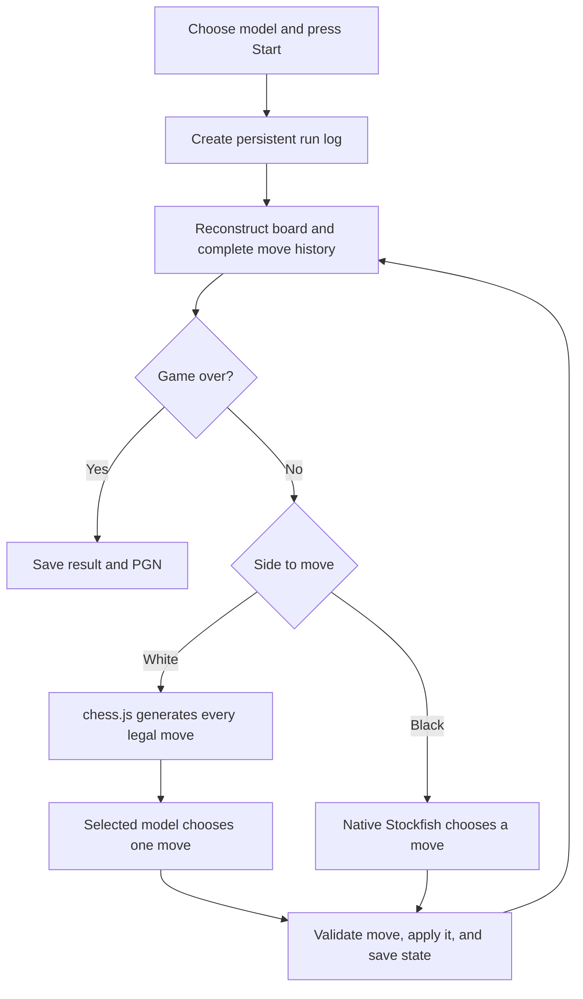

# Jevvy

A minimal chess site for watching AI models play White against native **Stockfish 19**. Choose a model and press **Start game**; the app plays both sides until checkmate or a rule-based draw. The board, controls, evaluation bar, run history, and costs are built with Next.js, React, TypeScript, Tailwind CSS, and chess.js.

All application code lives in [`code/`](code/). The model settings below describe the current implementation; changing them requires editing the server configuration and starting a new run.

| White player | Provider | Model ID | Reasoning |
| --- | --- | --- | --- |
| Jev 1.13 | OpenRouter Decisions | `typesafe/jev-1.13` | Choice API; no reasoning-effort setting |
| GPT-6 Astra | OpenAI Responses, directly | `gpt-6-astra` | Medium |
| GLM 5.3 | OpenRouter Chat Completions | `z-ai/glm-5.3` | Low |

Stockfish always plays Black at the fixed **Club** setting: skill 6, depth 9, maximum 650 ms per search, one thread, and 16 MB hash. This is deliberately weaker than full-strength Stockfish. The viewer does not make the normal game moves.

## Run locally

Use **Node.js 22.22.3** (see `code/.nvmrc`) and install the native Stockfish 19 executable. On macOS, `brew install stockfish` installs the engine. The app detects common Homebrew/Linux locations and `PATH`; `STOCKFISH_PATH` can override detection.

```bash
cd code
npm ci
# Create a local-only configuration file if you do not already have one.
touch .env.local
```

Edit `code/.env.local` locally and set the variables needed for the models you want to use:

```dotenv
OPENROUTER_API_KEY=your_openrouter_key
OPENAI_API_KEY=your_openai_key
# Optional:
# STOCKFISH_PATH=/absolute/path/to/stockfish
# CHESS_RUNS_DIR=/absolute/path/to/private/run-logs
```

OpenRouter is used for Jev and GLM; Astra uses its own OpenAI key. Keep these variables server-only, without a `NEXT_PUBLIC_` prefix. **No `.env*` files, including example templates, are tracked in this repository.** Keys, private run data, dependencies, and generated builds are excluded from Git.

```bash
npm run dev -- --hostname 127.0.0.1
```

Open [localhost:3000](http://localhost:3000), select the White model, and press **Start game**. Restart the server after changing configuration. Loading the page or checking provider configuration does not make a paid inference request.

For a production build:

```bash
npm run build
npm start -- --hostname 127.0.0.1
```

The backend needs Node.js and permission to spawn Stockfish. Static export and Edge-only hosting cannot run this implementation. No Python package or provider SDK is needed; server-side `fetch` calls the model APIs.

## How a game works



[`ChessSession`](code/src/lib/chess-session.ts) owns the browser game and runs one sequential turn loop. It passes the initial FEN plus the complete UCI move history to the server. Replaying the full history preserves repetition and draw rules; it is not just sending isolated board images.

For each turn, the app checks whether the game is over, obtains a move from the correct player, verifies it is legal in the expected position, applies it with chess.js, and persists the updated state. Checkmate, stalemate, threefold repetition, the fifty-move rule, insufficient material, castling, en passant, and all four promotions are supported.

**Pause** cancels pending work; **Resume** continues from the current board. **Undo** takes back a turn and pauses. **New game** creates a fresh run. Late responses from an earlier game or cancelled turn are ignored. A provider may still charge a request that was already processed before cancellation. In the website, an API failure pauses the game and requires an explicit retry; it never substitutes a Stockfish move for a model move.

Refreshing the page resets the in-memory board. Saved run logs survive, but the website does not currently resume archived games. The benchmark runner does support resuming its own saved games.

## How Jev is implemented

Jev chooses from a finite list of legal actions. **chess.js generates that list**; Stockfish does not rank it or tell Jev which move is strongest.

1. The browser adapter in [`jev.ts`](code/src/lib/jev.ts) sends the position and run ID to `POST /api/jev`. It never receives an API key.
2. [`createDecisionRequest()`](code/src/lib/server-jev.ts) validates and replays the supplied position/history. It rejects malformed positions, illegal histories, finished games, Black-to-move requests, and more than 255 choices.
3. It builds a structured state containing FEN, descriptive piece locations, SAN move history, check status, castling rights, the en-passant square, and move counters.
4. Every legal move becomes an entry in `questions.move.criteria`. The key is UCI notation, such as `e2e4`; the description includes SAN, the piece, origin/destination, captures, castling, or promotion. Distinct promotion choices stay distinct.
5. [`loggedDecision()`](code/src/lib/logged-decision.ts) binds the request to the run's model, provider, and reasoning setting, then saves the exact request before spending provider credits.
6. The server sends the payload to `POST https://openrouter.ai/api/alpha/decisions`, using the server's OpenRouter key and the pinned `typesafe/jev-1.13` model.
7. The selected action is read from `answers.move.choice`. It must exactly match a key in the offered legal choices. Missing or invalid choices fail the turn; there is no guess, nearest-match repair, or engine fallback.
8. The server returns the move with its FEN, offered choices, actual response model, latency, optional confidence, response ID, and billing usage. The browser checks the FEN and legality again before applying it. Stockfish then plays Black, and Jev receives the updated state for the next White turn.

The request has `model`, `state`, and `questions.move`, whose type is `choice`. Its instruction is to select the best legal move for White to improve its position and ultimately checkmate Black. The full contract and a complete opening-position example are in the [Jev API research](code/docs/jev-api-research.md).

Jev's optional confidence is a choice-model confidence, **not a chess win probability**. The server has a 30-second Jev request timeout and a two-request concurrency limit per process. Private upstream error bodies and credentials are not forwarded to the browser or written to run logs.

## Astra and GLM

Both adapters reuse Jev's deterministic state and complete legal-choice construction, so each model receives the same kinds of chess information. Neither receives engine scores or move rankings.

- [`server-astra.ts`](code/src/lib/server-astra.ts) calls OpenAI's Responses API directly, with Medium reasoning, `store: false`, Standard service tier, and a strict JSON schema whose `move` field is an enum of all legal UCI moves. The website defaults to a 4,096-token output cap, including reasoning, and a 90-second server deadline.
- [`server-glm.ts`](code/src/lib/server-glm.ts) calls OpenRouter Chat Completions with Low reasoning, a 16,384-token combined output cap, and a 300-second deadline. It requires providers to support the requested parameters and uses the same strict legal-move schema. Returned reasoning text is excluded; reasoning usage is still billed.

GLM's default Max setting repeatedly exhausted the output cap during initial tests, so the practical app setting is Low. Historical runs keep the reasoning setting used at the time, and a run cannot silently switch settings. Medium and Low are provider-specific settings, not equal reasoning budgets. See the [GLM integration research](code/docs/glm-api-research.md).

## Evaluation bar

The bar uses a **separate native Stockfish analysis**, at skill 20, up to depth 16 and 600 ms. Positive scores favor White, negative scores favor Black, and mate scores indicate the engine's reported forced mate. Scores always retain White's perspective, even when the board is flipped.

This analysis is for the viewer only. It is never added to the model input. The fill is a visual score scale, not a calibrated chance of winning. The benchmark skips this display-only analysis during play and evaluates terminal/capped positions only.

## Run logs and costs

[`run-store.ts`](code/src/lib/run-store.ts) stores each run as a UUID-named JSON file under `code/data/runs/`, or under `CHESS_RUNS_DIR` when configured. Writes use temporary files and atomic rename; per-run writes are serialized within a process, and repeated event IDs are deduplicated.

Logs contain model/provider/reasoning settings, opponent settings, initial position, exact model requests, decision results or errors, token usage, cost receipts, applied moves, state snapshots, and PGN. Credentials, authorization headers, and hidden reasoning text are excluded. The UI can inspect a run and export JSON or PGN.

| Provider | Cost recorded |
| --- | --- |
| OpenRouter: Jev and GLM | Actual `usage.cost` returned by OpenRouter |
| OpenAI: Astra | Calculated USD from returned token usage and the saved pricing snapshot |

[`costs.ts`](code/src/lib/costs.ts) handles input, cached input, cache writes, output, and reasoning usage. Reasoning tokens already included in output are not charged twice. Astra's rate snapshot is dated 18 September 2026; calculations preserve the rates used for each receipt rather than repricing historical runs.

Billing includes paid failed responses, including invalid moves or incomplete output. Missing usage on a timeout or network failure remains **unknown**, not zero. A run records known cost, reported/calculated subtotals, priced/unpriced/pending requests, and whether accounting is complete. A `+` in the UI indicates missing or pending charges. Calculated OpenAI totals are not invoices; account adjustments, taxes, and credit-purchase fees are outside this accounting.

`data/` is private local output and is not pushed to GitHub. Multiple independent processes should not write to the same run or benchmark manifest; the write queue is not a cross-process lock.

## Benchmarks

Run these commands from `code/`. They make paid provider requests and save normal run logs, a resumable manifest, and individual PGNs:

```bash
# 50 fresh games for GLM only
CHESS_BENCHMARK_MODELS=glm CHESS_BENCHMARK_GLM_CONCURRENCY=20 \
  node --env-file=.env.local --import tsx scripts/benchmark.ts \
  data/benchmarks/glm-50/results.json

# Read progress without making model calls
node scripts/benchmark-progress.mjs data/benchmarks/glm-50/results.json

# Audit saved moves, legal choices, receipts, PGNs, and results; export the report
node --env-file=.env.local --import tsx scripts/benchmark-report.ts \
  data/benchmarks/glm-50/results.json
```

For a new batch, `CHESS_BENCHMARK_MODELS` is a comma-separated list of `jev`, `astra`, and `glm`; the default is `jev,astra`. Each selected model gets 50 games as White against the same Club Stockfish. Running with an existing manifest resumes unfinished games using their saved state, without replaying a saved successful decision. Keep the model/reasoning settings unchanged when resuming.

Unlike the website, the runner can retry a failed move twice per execution pass. Every attempt stays in the logs. An error or the 400-ply safety cap is unfinished, never an automatic loss or draw. Win = 1 point, draw = 0.5, loss = 0. Provider concurrency overrides apply to the benchmark process; they do not change the website's normal limits. There is no evaluation-based resignation.

The report generator checks every saved move, matches White moves to model decisions, verifies all legal options were offered, replays PGNs, and checks terminal results against chess rules. This measures the chosen configuration against this particular Stockfish setting; it is not an Elo estimate or a general model ranking.

## Programmatic control

After the page hydrates, the browser exposes the same controller as the UI:

```js
await window.opening.start({ model: "jev" }); // also "astra" or "glm"
window.opening.getState();
window.opening.pause();
await window.opening.resume();
window.opening.undo();
window.opening.pgn();
window.opening.reset();
```

`start({ model, fen })` can load a custom legal position. A Black-to-move position starts with Stockfish. `window.opening.move(from, to, promotion?)` is a console-only legal move operation available while paused; it marks the PGN as edited. Board clicks/drags do not make human moves during model games.

## Server endpoints

| Route | Purpose |
| --- | --- |
| `GET /api/jev`, `/api/astra`, `/api/glm` | Read local model/key configuration; no inference |
| `POST /api/jev`, `/api/astra`, `/api/glm` | Request and log one White-model decision |
| `/api/stockfish` | Probe the native engine, select Black moves, or evaluate positions |
| `GET /api/runs` | List run summaries and costs |
| `POST /api/runs` | Create a run |
| `GET /api/runs/:id` | Read a run; `?format=summary` or `?format=pgn` selects exports |
| `POST /api/runs/:id` | Persist a validated game-state event |

This is currently a local app: same-origin checks and process limits exist, but user authentication and per-user spending quotas are not implemented. Keep the server bound to localhost for this setup.

## Tests and source map

```bash
cd code
npm test             # Mocked provider calls; no paid inference
npm run test:native  # Real locally installed Stockfish
npm run typecheck
npm run lint
npm run build
```

The provider tests use fake credentials and replace `fetch`. Coverage includes legal moves, special chess rules, cancellation, stale responses, state persistence, provider routing, historical reasoning labels, and billing for successful and failed attempts.

- [`chess-club.tsx`](code/src/components/chess-club.tsx): chooser, controls, board integration, and browser API.
- [`chess-session.ts`](code/src/lib/chess-session.ts): game lifecycle and sequential turn loop.
- [`server-jev.ts`](code/src/lib/server-jev.ts): complete chess-state/choice construction and Jev Decisions transport.
- [`logged-decision.ts`](code/src/lib/logged-decision.ts): request-before-inference logging and run binding.
- [`native-stockfish.ts`](code/src/lib/native-stockfish.ts): validated UCI input, process lifecycle, search, and analysis.
- [`run-store.ts`](code/src/lib/run-store.ts), [`run-costs.ts`](code/src/lib/run-costs.ts), and [`costs.ts`](code/src/lib/costs.ts): persistence and billing.
- [`scripts/`](code/scripts/): benchmarks, progress, report auditing, and legacy cost backfill.

Stockfish is GPL-3.0 and is installed separately; its binary is not bundled here. See [third-party notices](code/THIRD_PARTY_NOTICES.md) and the [detailed app guide](code/README.md).
